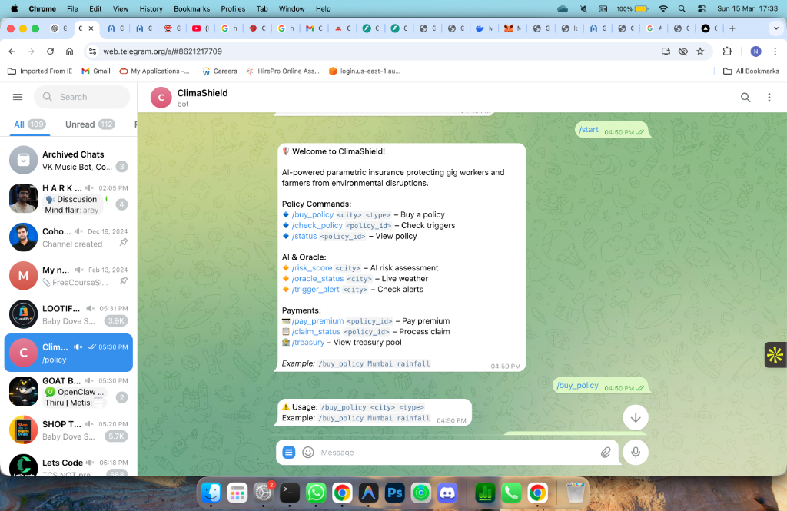
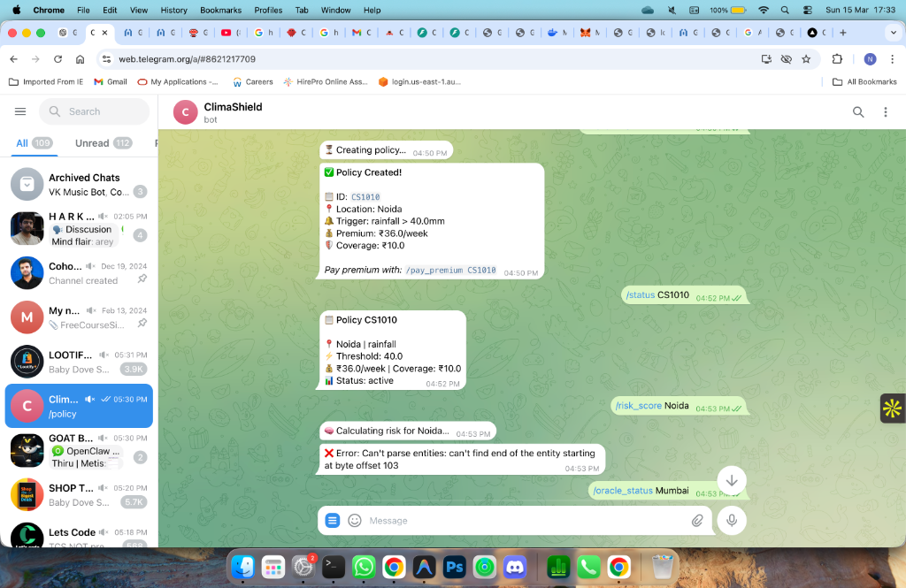
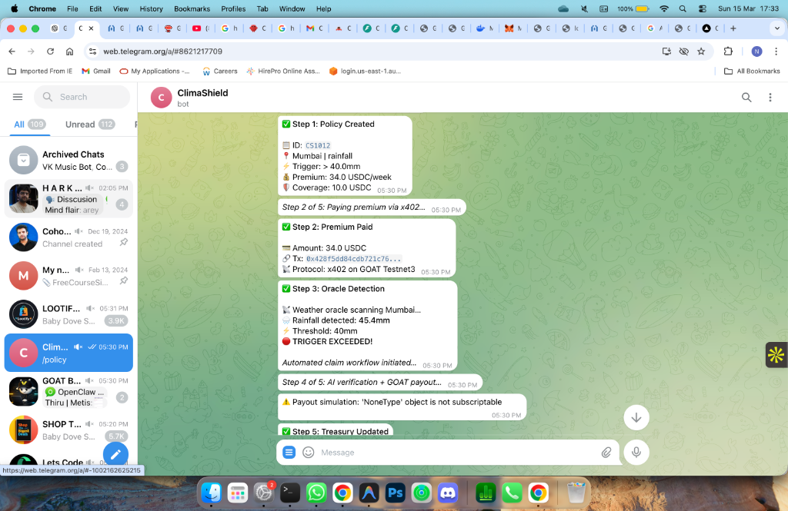
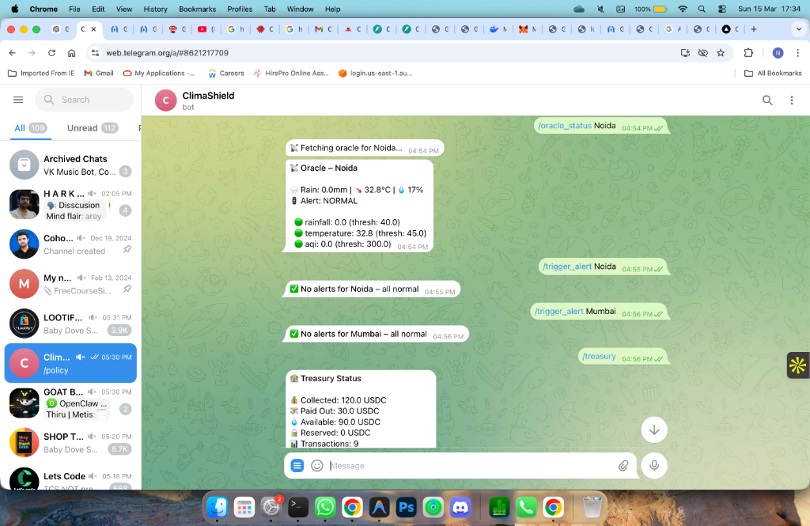

# 🛡️ ClimaShield – AI Parametric Insurance Platform

> AI-powered parametric insurance protecting gig workers and farmers from environmental disruptions (rain, floods, extreme heat, pollution).

**Built with:** OpenClaw Agents • Metis AI Compute • LazAI Data Layer • x402 Payments • GOAT Testnet3

---

## 🏗️ Architecture

<p align="center">
  
</p>

---

## 📸 Telegram Bot Demo

### Bot Welcome & Commands
<p align="center">
  
</p>

### Policy Creation & Status
<p align="center">
  
</p>

### Full Demo Flow (Oracle → AI → GOAT Payout)
<p align="center">
  
</p>

### Oracle Status & Treasury
<p align="center">
  
</p>

---

## 📂 Project Structure

```
climashield/
├── app/
│   ├── agents/         # OpenClaw agents (Coordinator, Weather, Risk, Claim)
│   ├── api/routes.py   # 22 API endpoints
│   ├── models/         # Pydantic models
│   ├── services/       # Risk, identity, logging, scheduler
│   ├── config.py       # Environment configuration
│   └── main.py         # FastAPI app with lifecycle
├── oracle/             # Oracle monitor + validator
├── lazai/              # LazAI verifiable data storage
├── payments/           # x402 client, GOAT wallet, treasury, payouts
├── telegram/           # Telegram bot (14 commands)
├── data/               # JSON stores (policies, treasury)
├── docs/screenshots/   # Demo screenshots
├── test_commands.sh    # API test script
├── Dockerfile          # Production container
├── docker-compose.yml  # Multi-service deployment
└── requirements.txt    # Python dependencies
```

---

## 🚀 Quick Start

```bash
# 1. Clone and setup
git clone https://github.com/kantinilesh/ClimaShield.git
cd ClimaShield
cp .env.example .env  # Edit with your API keys

# 2. Install
pip install -r requirements.txt

# 3. Run API server
uvicorn app.main:app --reload --port 8000

# 4. Run Telegram bot (separate terminal)
python telegram/bot.py

# 5. Test all APIs
./test_commands.sh
```

### Docker

```bash
docker-compose up -d
```

---

## 🤖 Telegram Commands

### Core Commands
| Command | Description |
|---------|-------------|
| `/start` | Welcome + help |
| `/buy_policy <city> <type>` | Create policy (rainfall/temperature/aqi) |
| `/check_policy <id>` | Check triggers |
| `/status <id>` | View policy details |
| `/pay_premium <id>` | Pay premium via x402 |
| `/claim_status <id>` | Process claim + GOAT payout |
| `/treasury` | Treasury pool status |
| `/wallet` | GOAT BTC wallet balance |

### AI & Oracle
| Command | Description |
|---------|-------------|
| `/risk_score <city>` | AI risk assessment |
| `/oracle_status <city>` | Live weather data |
| `/trigger_alert <city>` | Check active alerts |

### 🎮 Demo Commands (For Judges)
| Command | Description |
|---------|-------------|
| `/demo <city>` | Simulate heavy rain >40mm → full claim payout |
| `/demo_aqi <city>` | Simulate dangerous AQI >250 → claim payout |
| `/demo_full` | **Complete end-to-end lifecycle** (auto) |

### Recommended Judge Demo Flow

```
1. /start              → See all commands
2. /wallet             → Check initial BTC balance
3. /demo_aqi Delhi     → AQI 320 triggers auto payout (real BTC tx)
4. /wallet             → See balance decreased (0.0001 BTC used)
5. /demo Mumbai        → Rainfall 50mm+ triggers claim
6. /wallet             → Balance decreased again
7. /demo_full          → Full 5-step lifecycle
8. /treasury           → Insurance pool finances
```

---

## 📡 API Endpoints (22 total)

### Health & Monitoring
| Method | Endpoint | Description |
|--------|----------|-------------|
| GET | `/health` | Health check with agent status |
| GET | `/logs/recent` | Recent system logs |
| GET | `/logs/summary` | Event summary |

### Policies
| Method | Endpoint | Description |
|--------|----------|-------------|
| POST | `/policy/create` | Create parametric policy |
| GET | `/policies` | List all policies |
| GET | `/policy/{id}` | Get policy details |
| POST | `/policy/check-trigger` | Check triggers |

### Oracle & Risk
| Method | Endpoint | Description |
|--------|----------|-------------|
| GET | `/oracle/latest` | Latest oracle data |
| GET | `/oracle/history/{city}` | City oracle history |
| GET | `/risk/{city}` | AI risk assessment |

### Payments & Claims
| Method | Endpoint | Description |
|--------|----------|-------------|
| POST | `/payments/create-premium` | Pay premium via x402 |
| POST | `/claims/process` | Process claim + payout |
| GET | `/claims/history` | Claim history |
| GET | `/treasury/status` | Treasury pool |
| GET | `/wallet/balance` | GOAT BTC balance |

### Simulation
| Method | Endpoint | Description |
|--------|----------|-------------|
| POST | `/simulate/rainfall` | Simulate heavy rain |
| POST | `/simulate/heat` | Simulate extreme heat |
| POST | `/simulate/pollution` | Simulate pollution |
| POST | `/simulate/flood` | Simulate flood |

---

## 💰 How Claims Work

```
User buys policy → Pays BTC premium → Oracle monitors weather
       ↓                                       ↓
  Policy stored                     Threshold exceeded?
                                           ↓ YES
                              AI Agent verifies claim
                                           ↓
                              GOAT Testnet3 BTC payout
                              (real on-chain transaction)
                                           ↓
                              Treasury updated, proof on LazAI
```

Each payout sends **0.0001 BTC** from the treasury wallet on GOAT Testnet3 (Chain 48816).

---

## 🔍 Trigger Thresholds

| Type | Threshold | Demo Cities |
|------|-----------|-------------|
| Rainfall | > 40mm | Mumbai (42mm) ✅ |
| AQI | > 250 | Delhi (320), Lucknow (340), Kanpur (360) ✅ |
| Temperature | > 42°C | Delhi (38°C) |

---

## ⚙️ Environment Variables

```env
WEATHER_API_KEY=         # OpenWeatherMap API key
TELEGRAM_BOT_TOKEN=      # Telegram bot token
GOAT_PRIVATE_KEY=        # GOAT wallet private key (for BTC payouts)
GOAT_RPC_URL=            # GOAT Testnet3 RPC
GOAT_CHAIN_ID=48816      # Chain ID
GOATX402_API_URL=        # x402 payment API
GOATX402_MERCHANT_ID=    # Merchant ID
GOATX402_API_KEY=        # x402 API key
RECEIVE_WALLET=0x...     # Treasury wallet address
```

---

## 🧪 Testing

```bash
# Test all backend APIs
./test_commands.sh

# Test specific section
./test_commands.sh wallet    # GOAT BTC balance
./test_commands.sh oracle    # Weather + risk
./test_commands.sh admin     # Database metrics
./test_commands.sh env       # Check .env + DB

# GOAT Explorer (verify real transactions)
# https://explorer.testnet3.goat.network/address/<YOUR_WALLET>
```

---

## 📊 Phase Summary

| Phase | Features | Status |
|-------|----------|--------|
| **1** | Agents, FastAPI, Telegram, policies, weather API | ✅ |
| **2** | AI risk engine, oracle monitoring, LazAI storage | ✅ |
| **3** | x402 payments, GOAT wallet, treasury, payouts | ✅ |
| **4** | Background workers, simulation, logging, Docker | ✅ |
| **5** | Demo mode, AQI triggers, real BTC payouts | ✅ |

---

## 🛠️ Tech Stack

- **Backend**: FastAPI + Python 3.11
- **AI Agents**: OpenClaw, Metis risk scoring, LazAI proof datasets
- **Blockchain**: GOAT Testnet3 (Chain 48816), x402 protocol
- **Interface**: Telegram Bot (python-telegram-bot)
- **Weather**: OpenWeatherMap API
- **Database**: SQLite (dev) / PostgreSQL (prod) + SQLAlchemy
- **Deployment**: Docker + docker-compose
